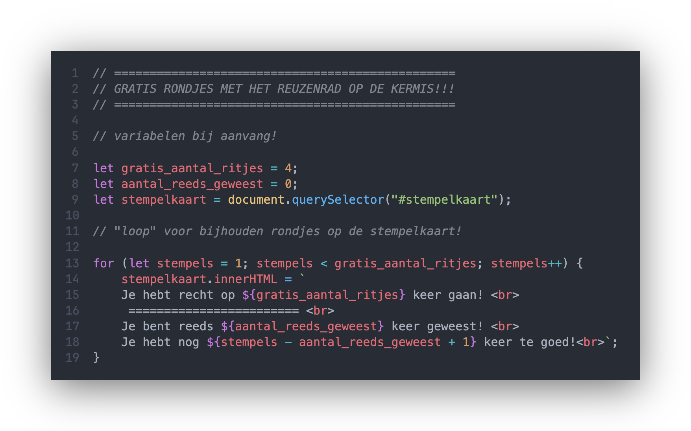
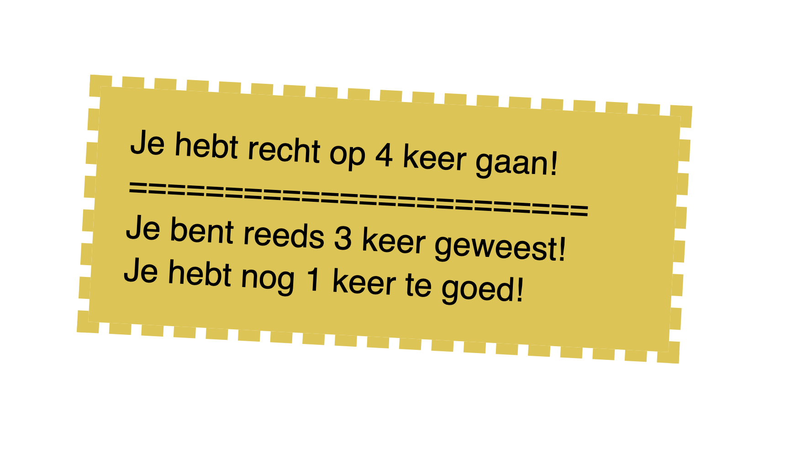

Bestanden **downloaden** naar je laptop? [Klik hier](https://github.com/CMD-Groningen/computational-thinking-uitgebreid/archive/refs/heads/master.zip)     
Preview in de browser? [Klik hier](https://cmd-groningen.github.io/computational-thinking-uitgebreid)  
Speel live met deze code in **CodeSandbox** > [Klik hier!](https://codesandbox.io/s/github/CMD-Groningen/computational-thinking-uitgebreid) 

-------------

# 💻 Computational thinking
> Deze versie heeft ook INPUT (stempelkaart button) Voor de basisversie zonder input > [Klik hier](https://github.com/CMD-Groningen/computational-thinking)
> Bij **computational thinking** wordt datgene wat de computer moet doen op een zodanige manier aan de computer "verteld" dat de computer snapt wat die moet doen!

> Computational thinking is niet alleen handig voor het bedenken van taken die een computer moet doen om een probleem op te lossen. Een CMD student kan dit ook als mindset gebruiken om complexe problemen te vereenvoudigen, zodat deze vertaald kunnen worden naar praktische oplossingen.

## 🎢 Case: Gratis ritjes in het reuzenrad op de kermis!

Een kermis uitbater bedenkt een actie om kermisklanten gratis ritjes op het reuzenrad aan te bieden. Bedenk een oplossing die de kermisklant en de uitbater kunnen helpen tijdens het faciliteren van de gratis ritjes op het reuzenrad!

### Computational Thinking voor de oplossing

- Hoe zou de uitbater kunnen bijhouden hoeveel ritjes de klant al heeft gemaakt?
- Hoe zou je kunnen bijhouden hoeveel ritjes de kermisklant nog te goed heeft?
- Wat is nodig om bij te kunnen houden hoeveel ritjes kermisklanten mogen doen?
- Een stempelkaart misschien?

